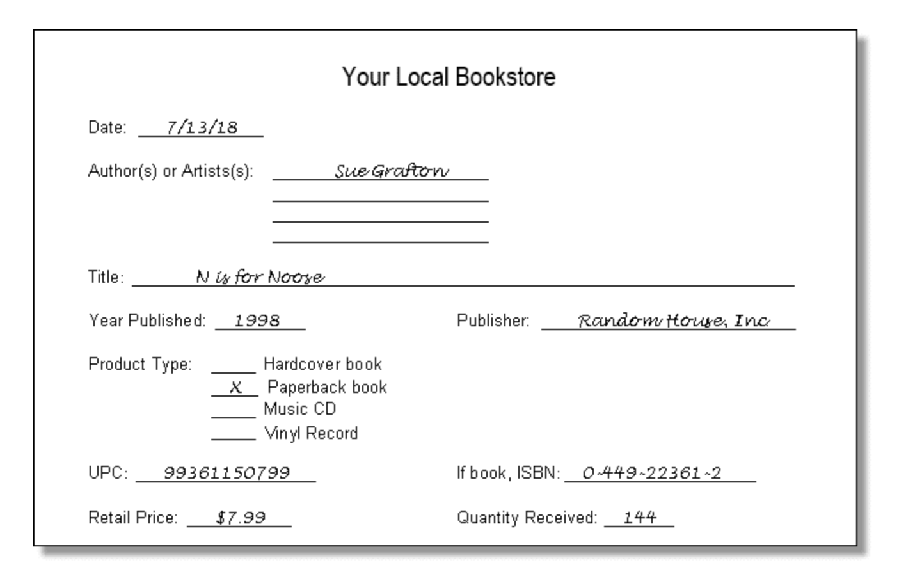

## 1. Objectives and Scope :books:

- Overall Goals: Understand the primary objectives of the project and how the database will help achieve these goals.
- Scope: Define the boundaries of the project, including what is included and what is out of scope
# Functional Requirements
## Core Functions
- Detailed description of the functions and features the database needs to support.
- User Stories: Specific scenarios where users interact with the system, describing what actions they take and what they expect as outcomes.
## Data Requirements
- Data Entities: Identify all the major entities (e.g., customers, products, orders) that need to be modeled.
- Attributes: Detailed information about the attributes of each entity, including data types, constraints, and default values.
## Non-Functional Requirements
- Performance: Expected performance metrics, such as response time, transaction speed, and scalability.
- Security: Security requirements, including data encryption, user authentication, and access control.
- Compliance: Regulatory and compliance requirements

## 2. Gathering Requirements 
 
### New Inventory Form
 
 
**Questions:**
1. Is the date recorded once receiving the inventory, or is it the publication date of the item?
 
2. Is there a maximum limit on the number of authors/artists recorded?
 
3. Are there any additional attributes associated with each product type?
 
4. Are UPC and ISBN mandatory for all inventory items?
 
### Inventory Spreadsheet
 
 
**Questions:**
1. **Last Inventory:**
   - How frequently is the inventory count updated in the spreadsheet?
   - Is there a specific process for reconciling discrepancies between last inventory and on-hand quantity?
 
2. **Sales Since:**
   - What timeframe does "Sales Since" cover, and how is it calculated?
   - Are there any specific criteria for recording sales in this field?
 
3. **On Hand:**
   - How is the on-hand quantity adjusted for items sold or received?
   - Are there any special considerations for managing inventory levels?
 
### Customer Receipt
 
**Questions:**
1. **UPC:**
   - Is each item's UPC (Universal Product Code) recorded individually on the receipt?
   - How are multiple items (e.g., series) recorded on the receipt?
 
2. **Quantity:**
   - Is there a maximum quantity limit for a single transaction?
   - How is quantity calculated for products sold as part of a bundle or package deal?
 
3. **Price (with tax):**
   - How is tax calculated and applied to each item?
   - Are there any discounts or promotions applied to the total price?
 
### Monthly Sales Report :dollar:
 
**Questions:**
1. **Title:**
   - How are products categorized for reporting purposes?
   - Are there any specific metrics or key performance indicators (KPIs) tracked for each title?
 
2. **Retail Price:**
   - How is the retail price determined, and are there any fluctuations in pricing?
   - Is there a standard pricing strategy applied across all products?
 
3. **Quantity:**
   - How is quantity calculated for products sold as part of a bundle or package deal?
   - Are there any products excluded from the sales report?
 
4. **Net after Discounts:**
   - How are discounts applied, and are they consistent across all products?
   - Are there any special considerations for reporting discounted items versus full-price items?
 
### Desk Calendar
 
**Additional Questions:**
1. **Event Scheduling:**
   - How far in advance are events typically scheduled?
   - Are there any peak seasons or specific months where event scheduling is more intensive?
 
2. **Website Integration:**
   - What platform is used for the store's website, and how is event information updated and displayed?
   - Are there any specific features or functionalities required for integrating the event calendar with the website?
 
3. **Inventory Management:**
   - How is inventory updated based on scheduled events (e.g., ordering extra copies of books or CDs)?
   - Are there any automated notifications or reminders for inventory management based on scheduled events?
 
4. **Event Reminders:**
   - What is the preferred method of receiving reminders for upcoming events (e.g., email, SMS)?
   - How far in advance do event reminders need to be sent out?

## 3. Critical information

#### there were 4 types of forms provided :
1. paper form to collect information on new titles recived 
1. Inventory spreadsheet
1. A receipt given to a customer
1. Monthly sales report provided to store owners and management team

## inventory content :

1- Name and ID of Local Bookstore.(String)
2- Date of buying product (Date)      
3- Name of Authors or Artists (List)
4- Name of product(String)
5-type of product(String)
6-Year of published (Date with yearsformat)
7- UPC (ID)
8-price (Float)
9-Name of Publisher(String)
10- ISBN(String)
11- Quantity(Int)
 
## Spreadsheet content :

1-Name and ID of Local Bookstore.(String)
2-UPC(ID of product)(Int)
3-Name of product(String)
4-Quantity Recerved (Int)
5-Sales number(Int)
6-remaning number(Calculated value)(Int)
7-Date of inter product(Date)
 
## Customer receipt content:

1-UPC(ID of product)(Int)
2-Quantity number(Int)
3-Discount code (Int)
4-Tax(Float)
5-SubTotal price for evry product (Calculated value)(Float)
6-Total price for all product(Calculated value)(Float)
7-ID of Saleperson (String)
8-Name and ID of Local Bookstore.(String)
 
## Monthly sales report:

1-Name and ID of Local Bookstore.(String)
2-Month(ENUM)
3-Type of product(String)
4-Name of product(String)
5-Price of product(Float)
6-Sale Quantity(Int)
7-Total sale price after discounts(Float)
 
## Desk calendar
1- Event name(String)
2- Event type(String)
3- Event date(Date)
4- Event time(time)
5- Check incoming(boolean)
6- Letter to store’s website(String)